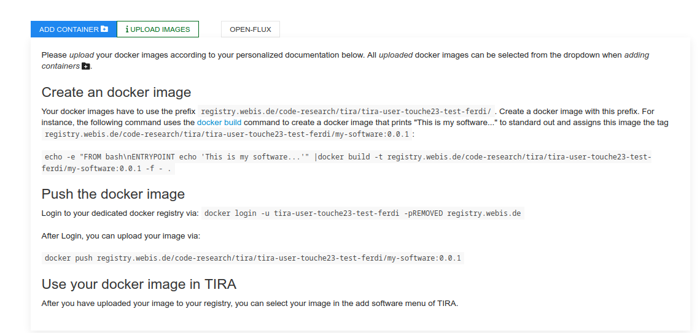

# PyTerrier Starter and Baseline for Task 3 on "Evidence Retrieval for Causal Questions"

This is the [PyTerrier](https://github.com/terrier-org/pyterrier) baseline for [task 3 on Image Retrieval for Arguments](https://touche.webis.de/clef23/touche23-web/image-retrieval-for-arguments.html) in [Touché 2023](https://touche.webis.de/clef23/touche23-web/).

There are two baselines, one full rank retrieval baseline (in [full-rank-pipeline.ipynb](full-rank-pipeline.ipynb)) that indexes all images before retrieval and one re-ranking baseline that re-ranks the results of some first-stage ranker (in [re-rank-pipeline.ipynb](re-rank-pipeline.ipynb)).

This image comes with a script [run-notebook.py](run-notebook.py) that allows you to run a PyTerrier retrieval pipeline implemented in a Jupyter Notebook in TIRA.

## Prerequisities:

You need to [install docker](https://docs.docker.com/get-docker/) on your machine.


## Run a Jupyter Notebook locally for Development

We have published this starter image on DockerHub so that you can directly run a notebook with everything installed with the following command (assuming you have cloned this repository and your current directory is the directory that contains this `README.md`):

```
docker run --rm -ti \
    -p 8888:8888 \
    -v ${PWD}:/workspace \
    webis/tira-touche23-task-3-pyterrier-baseline:0.0.1 \
    jupyter-lab --allow-root --ip 0.0.0.0
```

You can adapt/run the baseline notebooks locally locally with docker and can directly deploy and run it in [TIRA.io](https://www.tira.io/task/touche-task-3).

You can build this image your machine with this command:

```
docker build -t webis/tira-touche23-task-3-pyterrier-baseline:0.0.1 .
```


## Full Rank Starter/Baseline

The notebook [full-rank-pipeline.ipynb](full-rank-pipeline.ipynb) implements "full-rank" retrieval: all images are indexed with PyTerrier before retrieval with BM25.

You can run it on a small example dataset in your notebook.
To test your pipeline locally, you can make run the script [run-notebook.py](run-notebook.py) as `local-dry-run`, e.g., by:

```
./run-notebook.py \
    --input ${PWD}/sample-input/full-rank \
    --output ${PWD}/sample-output \
    --notebook /workspace/full-rank-pipeline.ipynb \
    --local-dry-run True
```


### Deploy and Run the Full Rank Starter in TIRA

First, you have to upload the image to TIRA.
TIRA gives you personalized credentials to upload your image:



For instance, to upload this baseline, you may tag the image accordingly and then push the image to your personal/private registry in TIRA, i.e., run the following commands (replace `<YOUR-TEAM-NAME>` with the name of your team as indicated by the personalized documentation in TIRA):

```
docker tag webis/tira-touche23-task-3-pyterrier-baseline:0.0.1 registry.webis.de/code-research/tira/tira-user-<YOUR_TEAM_NAME>/pyterrier:0.0.1
docker push registry.webis.de/code-research/tira/tira-user-<YOUR_TEAM_NAME>/pyterrier-baseline:0.0.1
```

With the image uploaded, you can add the TIRA software by specifying the following command in TIRA:

```
/workspace/run-notebook.py --notebook /workspace/full-rank-pipeline.ipynb --input $inputDataset --output $outputDir
```

The resulting software configuration in TIRA might look like this:


## Re-Rank Starter/Baseline


The notebook [re-rank-pipeline.ipynb](re-rank-pipeline.ipynb) implements a re-ranking baseline that re-ranks the results of some first-stage ranker.

You can run it on a small example dataset in your notebook.
To test your pipeline locally, you can make run the script [run-notebook.py](run-notebook.py) as `local-dry-run`, e.g., by:

```
./run-notebook.py \
    --input ${PWD}/sample-input/re-rank \
    --output ${PWD}/sample-output \
    --notebook /workspace/re-rank-pipeline.ipynb \
    --local-dry-run True
```


### Deploy and Run the Re-Rank Starter in TIRA

The deployment is [as above](#deploy-and-run-the-full-rank-starter-in-tira). I.e., Upload, you may tag the image accordingly and then push the image to your personal/private registry in TIRA, i.e., run the following commands (replace `<YOUR-TEAM-NAME>` with the name of your team as indicated by the personalized documentation in TIRA):

```
docker tag webis/tira-touche23-task-3-pyterrier-baseline:0.0.1 registry.webis.de/code-research/tira/tira-user-<YOUR_TEAM_NAME>/pyterrier:0.0.1
docker push registry.webis.de/code-research/tira/tira-user-<YOUR_TEAM_NAME>/pyterrier-baseline:0.0.1
```

With the image uploaded, you can add the TIRA software by specifying the following command in TIRA:

```
/workspace/run-notebook.py --notebook /workspace/re-rank-pipeline.ipynb --input $inputDataset --output $outputDir
```


# Additional Resources

- The [PyTerrier tutorial](https://github.com/terrier-org/ecir2021tutorial)
- The [PyTerrier documentation](https://pyterrier.readthedocs.io/en/latest/)
- The [TIRA quickstart](https://touche.webis.de/clef23/touche23-web/evidence-retrieval-for-causal-questions.html#tira-quickstart)


# Publishing this image

We publish this image via the following command:

```
docker push webis/tira-touche23-task-3-pyterrier-baseline:0.0.1
```

